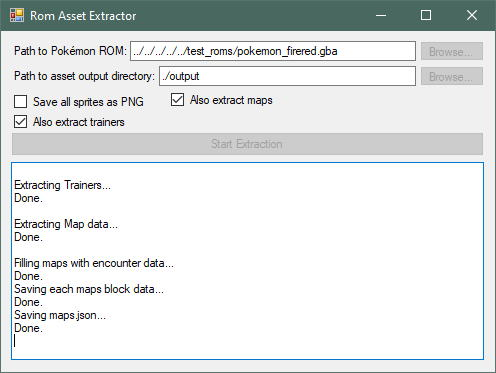
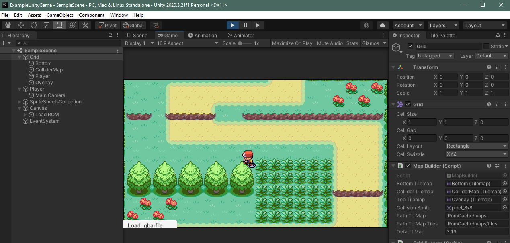

# ROM Asset Extractor (C#)

Intended to support exporting assets from third generation Pokémon games ([view game support](#Version-support)).


**Read how to get started:**

* **[❗ But first read the LICENSE and disclaimer](#License)**
* [🚀 Extracting assets from a .gba ROM file](#Usage)
* [🎮 Using extracted assets in a Unity game](#Using-extracted-assets-in-a-Unity-Game)


## Usage

The tool will extract all sprites, maps and tilesets to the specified directory ( `output`  by default)


### Command line

*Example:* `RomAssetExtractor.Cli.exe --rom "path/to/rom.gba" --sb false`

**All possible commands:**

    --rom or -r (required)
            The path to the Pokémon ROM to extract assets from.
    
    --output or -o
            The path to where the assets should be extracted.
            Defaults to: output
    
    --save-bitmaps or -sb
            Indicate that bitmaps should be saved alongside data by specifying True or False.
            Defaults to: True
    
    --save-trainers or -st
            Indicate that trainers should be saved alongside other data (and bitmaps) by specifying True or False.
            Defaults to: True
    
    --save-maps or -sm
            Indicate that maps should be saved alongside other data (and bitmaps) by specifying True or False.
            Defaults to: True
    
    --save-map-renders or -smr
            Indicate that full map renders should be saved alongside the tileset bitmaps by specifying True or False.
            Defaults to: False


### As Library in your own project

If you include the **RomAssetExtractor/RomAssetExtractor.csproj** (or built dll-files) as a library in your project you can call the following asynchronous method from your code:

```csharp
await AssetExtractor.ExtractRom(
        "path/to/rom",      // (string) Where is the rom to extract assets from
        "path/to/output",   // (string) Where should the assets be output to
        shouldSaveBitmaps,  // (boolean) Should the bitmaps be saved (true)? Or only the JSON data (false)?
        shouldSaveTrainers, // (boolean) Should trainers be saved?
        shouldSaveMaps,     // (boolean) Should maps be saved?
        logTextWriter       // (TextWriter) An object that inherits System.IO.TextWriter to which some progress logs will be written.
);
```


### UI

Build and run the **RomAssetExtractor.Ui.exe** for a Windows Forms application with friendly UI:




## Using extracted assets in a Unity Game

You can find a crude MapBuilder class in the Unity project located in `./ExampleUnityGame`. It demonstrates how to parse the JSON and draw the tilemaps. It also includes some basic movement controls and animations for a FireRed/LeafGreen hero character.




## Version Support

### Support Levels

| Level                                         | Species (Pokémon)                                            | Trainers                                                     | Maps                                  | Overworld | Battle                                                       | Items                                        | Decorations                   |
| --------------------------------------------- | ------------------------------------------------------------ | ------------------------------------------------------------ | ------------------------------------- | --------- | ------------------------------------------------------------ | -------------------------------------------- | ----------------------------- |
| **Missing**                                   |                                                              |                                                              |                                       |           |                                                              |                                              |                               |
| **Partial**                                   | Sprites(1), Base Stats, Evolutions, Experience Tables        | Sprites                                                      | Data(2), Tilesets and Wild Encounters | Sprites   | Move Sprites                                                 |                                              |                               |
| **Full** *(includes everything from Partial)* | Cry Audio, Egg Data, Level Up Learnset, Pokedex Order & Categories, Types, HM Learnsets, TM Learnsets, Sprite Battle Offsets (own and enemy) | Names, Party, Interaction Texts, Battle Tower, Back Sprite Animations | Connections, Respawn Points           |           | Move Animation Scripts, Damage Calculations, Move Backgrounds | Sprites, Effects, Texts, Berries,  Ball Data | Sprites, Descriptions,  Tiles |

**Notes:**

1. Animated images are stored as horizontal sheets containing all animation frames.
2. Collisions, behaviors, surfable areas, jumpable areas, etc. all included in `.json` data files. Each map has two json files:
   - JSON Object containing map information like: size, name and encounters.
   - JSON Array with data on each tile (file can be up to 2000KB for big maps). If a map is 40 by 20 tiles big, then there will be 800 entries in this file. Each tile is represented as a JSON Object.


### Versions

As you will notice only the English (_ _ _ E) for some versions of the third gen games are tested and partially supported.

| Name           | Missing Support              | Partial Support | Full Support |
|----------------|----------|----------|----------|
| **Ruby (USA)** | AXVD, AXVF, AXVI, AXVJ | AXVE |  |
| **Sapphire (USA)** | AXPD, AXPE, AXPF, AXPI, AXPJ |  |  |
| **Emerald (USA)** | BPED, BPEE, BPEF, BPEI, BPEJ |  |  |
| **FireRed (USA)** | BPRD, BPRF, BPRI, BPRJ | BPRE |  |
| **LeafGreen (USA)** | BPED, BPEF, BPEI, BPEJ | BPEE |  |

*The following games are not yet supported: Sapphire, Emerald and any non-English version of the above games. For most games it is just a matter of configuring the correct offsets in `pokeroms.yml` before they will work.*


## License

*(See [LICENSE](LICENSE) file for full license text)*

Copyright (C) 2021 TheJjokerR

This program is free software: you can redistribute it and/or modify it under the terms of the GNU
General Public License as published by the Free Software Foundation, either version 3 of the
License, or (at your option) any later version.

This program is distributed in the hope that it will be useful, but WITHOUT ANY WARRANTY; without
even the implied warranty of MERCHANTABILITY or FITNESS FOR A PARTICULAR PURPOSE.  See the GNU
General Public License for more details.


### 😍 Additional Credits

* Nintendo/Creatures Inc./GAME FREAK inc. Pokémon, Pokémon character names are trademarks of Nintendo. 
* I was first inspired to make this project by first wanting to translate [python code by magical at magical/pokemon-gba-sprites/](https://github.com/magical/pokemon-gba-sprites/) to C#.
* Thanks [jugales](https://pokewebkit.com/start) for this goldmine of offset/address information: [jugales/pokewebkit](https://github.com/jugales/pokewebkit).
* This repo uses some code for Bitmap and PNG writing adapted from "unLZ-GBA replacement" by Nintenlord: https://www.romhacking.net/community/975/.
* Thanks to the tile extraction code in [this repo by kaisermg5](https://github.com/kaisermg5/jaae) I was able to make progress a lot faster.


## ❗ Disclaimer

I am an independent developer and am not affiliated with Nintendo or Pokémon in any way. I'm just a 
fan of the games who was inspired to create this for my own educational purposes.

I am no lawyer. Nothing I write or say is legal advice. I strongly discourage you from
using/applying this software in any malicious or illegal manner. 

As stated in the license text I can not be held accountable for anything you do with this software
or it's derived works.

Extracting ROM-files from game cartridges you own may be illegal in your country. For other reasons
this tool or the way it is used may be illegal in your country.

Please respect the copyright holders of all copyrighted material mentioned here.
